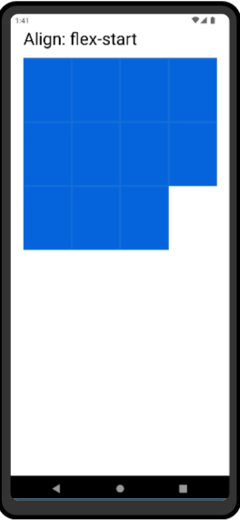
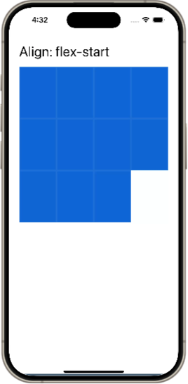
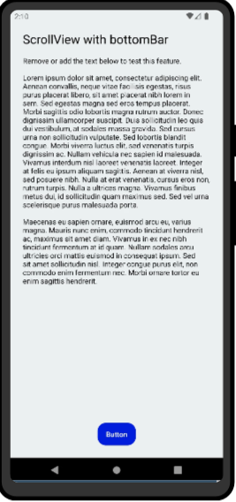
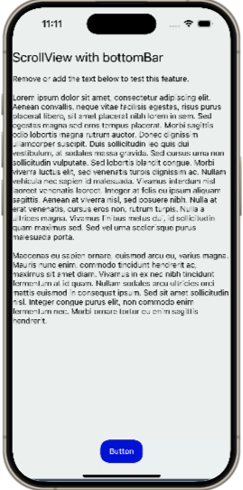

# Code Vault

Welcome to Code Vault! This repository is a comprehensive collection of articles, tips, and code snippets for various development areas. Dive in and enhance your coding skills!

## Table of Contents

- [Tips](#tips)
- [Code](#code)

## Tips

### General
- **Tip 1:** Description of tip 1.
- **Tip 2:** Description of tip 2.

## Code

1. [Grid](https://snack.expo.dev/@gedson.marcelino/grid)

Simple grid layout in React Native using the Stylesheet API. It showcases the flexibility of React Native's styling system to arrange components in a grid format, making it useful for developing visually appealing and organized layouts for mobile applications.

[#javascript]() [#react-native]()

2. [ScrollView with bottom content](https://snack.expo.dev/@gedson.marcelino/scroll-bottom-bar)

This example demonstrates how to create a `ScrollView` in React Native with a bottom bar that remains independent of the scrollable content's height. The bottom bar stays fixed at the bottom of the screen while the content in the `ScrollView` can be scrolled vertically. This pattern is useful for creating layouts where you need persistent navigation or action buttons accessible at the bottom of the screen.

[#javascript]() [#react-native]()

## Author

Gedson Marcelino
- [GitHub](https://github.com/gedsonmarcelino)
- [LinkedIn](https://www.linkedin.com/in/gedsonmarcelino/)

Feel free to reach out with any questions or suggestions!